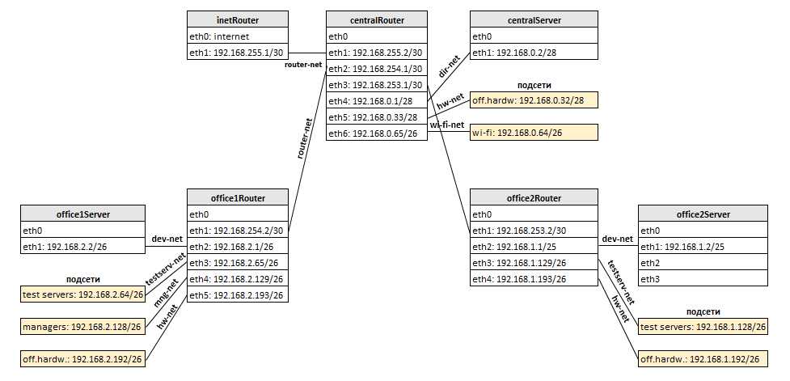

# 18. Сетевая архитектура. Разворачиваем сетевую лабораторию.
## Задание

### Дано
- Vagrantfile с начальным  построением сети
- inetRouter
- centralRouter
- centralServer

Тестировалось на virtualbox

### Планируемая архитектура
Построить следующую архитектуру:

### Сеть office1
- 192.168.2.0/26    - dev
- 192.168.2.64/26   - test servers
- 192.168.2.128/26  - managers
- 192.168.2.192/26  - office hardware

### Сеть office2
- 192.168.1.0/25    - dev
- 192.168.1.128/26  - test servers
- 192.168.1.192/26  - office hardware

### Сеть central
- 192.168.0.0/28    - directors
- 192.168.0.32/28   - office hardware
- 192.168.0.64/26   - wifi

```
Office1 ---\
      -----> Central --IRouter --> internet
Office2----/
```

Итого должны получится следующие сервера:
- inetRouter
- centralRouter
- office1Router
- office2Router
- centralServer
- office1Server
- office2Server

### Теоретическая часть
- Найти свободные подсети
- Посчитать сколько узлов в каждой подсети, включая свободные
- Указать broadcast адрес для каждой подсети
- проверить нет ли ошибок при разбиении

### Практическая часть
- Соединить офисы в сеть согласно схеме и настроить роутинг
- Все сервера и роутеры должны ходить в инет черз inetRouter
- Все сервера должны видеть друг друга
- У всех новых серверов отключить дефолт на нат (eth0), который вагрант поднимает для связи
- При нехватке сетевых интервейсов добавить по несколько адресов на интерфейс

### Критерии оценки: 
- 4 - сделана хотя бы часть
- 5 - все сделано

# Выполнение практической части

### Демонстрационный стенд с серверами разворачивается с помощью [Vagrantfile](Vagrantfile)

В случае выявления проблем при тестировании (ping и т.д.) может потребоваться перезапуск сети на хостах (не воспроизвелось после фикса).

### Логическая схема объединения хостов и подсетей



## Проверка видимости серверов и выхода в интернет

- #### с сервера office1Server

```
[vagrant@office1Server ~]$ ping -c 3 192.168.1.2 ; ping -c 3 192.168.0.2 ; ping -c 3 mail.ru
PING 192.168.1.2 (192.168.1.2) 56(84) bytes of data.
64 bytes from 192.168.1.2: icmp_seq=1 ttl=61 time=0.962 ms
64 bytes from 192.168.1.2: icmp_seq=2 ttl=61 time=0.905 ms
64 bytes from 192.168.1.2: icmp_seq=3 ttl=61 time=0.946 ms

--- 192.168.1.2 ping statistics ---
3 packets transmitted, 3 received, 0% packet loss, time 2002ms
rtt min/avg/max/mdev = 0.905/0.937/0.962/0.042 ms
PING 192.168.0.2 (192.168.0.2) 56(84) bytes of data.
64 bytes from 192.168.0.2: icmp_seq=1 ttl=62 time=0.610 ms
64 bytes from 192.168.0.2: icmp_seq=2 ttl=62 time=0.686 ms
64 bytes from 192.168.0.2: icmp_seq=3 ttl=62 time=0.724 ms

--- 192.168.0.2 ping statistics ---
3 packets transmitted, 3 received, 0% packet loss, time 2001ms
rtt min/avg/max/mdev = 0.610/0.673/0.724/0.051 ms
PING mail.ru (217.69.139.202) 56(84) bytes of data.
64 bytes from mail.ru (217.69.139.202): icmp_seq=1 ttl=57 time=52.2 ms
64 bytes from mail.ru (217.69.139.202): icmp_seq=2 ttl=57 time=52.0 ms
64 bytes from mail.ru (217.69.139.202): icmp_seq=3 ttl=57 time=51.4 ms

--- mail.ru ping statistics ---
3 packets transmitted, 3 received, 0% packet loss, time 2002ms
rtt min/avg/max/mdev = 51.484/51.905/52.207/0.359 ms
```
```
[vagrant@office1Server ~]$ traceroute 192.168.1.2 ; traceroute 192.168.0.2

traceroute to 192.168.1.2 (192.168.1.2), 30 hops max, 60 byte packets
 1  gateway (192.168.2.1)  0.209 ms  0.152 ms  0.113 ms
 2  192.168.255.2 (192.168.255.2)  0.288 ms  0.571 ms  0.484 ms
 3  192.168.253.2 (192.168.253.2)  0.615 ms  0.581 ms  0.546 ms
 4  192.168.1.2 (192.168.1.2)  0.979 ms  0.617 ms  0.558 ms

traceroute to 192.168.0.2 (192.168.0.2), 30 hops max, 60 byte packets
 1  gateway (192.168.2.1)  0.199 ms  0.145 ms  0.107 ms
 2  192.168.255.2 (192.168.255.2)  0.262 ms  0.231 ms  0.155 ms
 3  192.168.0.2 (192.168.0.2)  0.318 ms  0.306 ms  0.325 ms
```
```
[vagrant@office1Server ~]$ traceroute otus.ru
traceroute to otus.ru (80.87.192.10), 30 hops max, 60 byte packets
 1  gateway (192.168.2.1)  0.193 ms  0.136 ms  0.098 ms
 2  192.168.255.2 (192.168.255.2)  0.310 ms  0.279 ms  0.650 ms
 3  192.168.255.1 (192.168.255.1)  0.614 ms  0.581 ms  0.549 ms
 4  * * *
 5  * * *
 6  * * *
 7  * * *
 8  * * *
 9  sr2-vlan572.msk4.ip.di-net.ru (213.219.206.209)  4.465 ms  3.128 ms  3.090 ms
10  vl-733.sr19.msk4.ip.di-net.ru (213.248.3.185)  43.781 ms  42.508 ms  40.664 ms
11  213.219.206.18 (213.219.206.18)  3.781 ms  3.342 ms  4.087 ms
12  core.webdc.ru (92.63.108.98)  21.190 ms  17.651 ms  9.698 ms
13  main1.i.otus.ru (80.87.192.10)  4.082 ms  4.642 ms  3.380 ms
```
- #### c сервера office2Server

```
[root@office2Server vagrant]# ping -c 3 192.168.2.2 ; ping -c 3 192.168.0.2 ; ping -c 3 mail.ru
PING 192.168.2.2 (192.168.2.2) 56(84) bytes of data.
64 bytes from 192.168.2.2: icmp_seq=1 ttl=61 time=1.04 ms
64 bytes from 192.168.2.2: icmp_seq=2 ttl=61 time=0.890 ms
64 bytes from 192.168.2.2: icmp_seq=3 ttl=61 time=0.897 ms

--- 192.168.2.2 ping statistics ---
3 packets transmitted, 3 received, 0% packet loss, time 2002ms
rtt min/avg/max/mdev = 0.890/0.942/1.041/0.078 ms
PING 192.168.0.2 (192.168.0.2) 56(84) bytes of data.
64 bytes from 192.168.0.2: icmp_seq=1 ttl=62 time=0.667 ms
64 bytes from 192.168.0.2: icmp_seq=2 ttl=62 time=0.698 ms
64 bytes from 192.168.0.2: icmp_seq=3 ttl=62 time=0.837 ms

--- 192.168.0.2 ping statistics ---
3 packets transmitted, 3 received, 0% packet loss, time 2001ms
rtt min/avg/max/mdev = 0.667/0.734/0.837/0.073 ms
PING mail.ru (217.69.139.202) 56(84) bytes of data.
64 bytes from mail.ru (217.69.139.202): icmp_seq=1 ttl=57 time=53.1 ms
64 bytes from mail.ru (217.69.139.202): icmp_seq=2 ttl=57 time=51.2 ms
64 bytes from mail.ru (217.69.139.202): icmp_seq=3 ttl=57 time=51.4 ms

--- mail.ru ping statistics ---
3 packets transmitted, 3 received, 0% packet loss, time 2003ms
rtt min/avg/max/mdev = 51.243/51.931/53.124/0.886 ms
```
```
[root@office2Server vagrant]# traceroute 192.168.2.2 ; traceroute 192.168.0.2

traceroute to 192.168.2.2 (192.168.2.2), 30 hops max, 60 byte packets
 1  gateway (192.168.1.1)  0.192 ms  0.114 ms  0.073 ms
 2  192.168.255.2 (192.168.255.2)  0.719 ms  0.646 ms  0.598 ms
 3  192.168.254.2 (192.168.254.2)  0.938 ms  0.893 ms  0.857 ms
 4  192.168.2.2 (192.168.2.2)  1.183 ms  1.187 ms  1.190 ms

traceroute to 192.168.0.2 (192.168.0.2), 30 hops max, 60 byte packets
 1  gateway (192.168.1.1)  0.187 ms  0.133 ms  0.095 ms
 2  192.168.255.2 (192.168.255.2)  0.276 ms  0.177 ms  0.698 ms
 3  192.168.0.2 (192.168.0.2)  0.826 ms  0.792 ms  0.705 ms
```
```
root@office2Server vagrant]# traceroute otus.ru

traceroute to otus.ru (80.87.192.10), 30 hops max, 60 byte packets
 1  gateway (192.168.1.1)  0.259 ms  0.204 ms  0.144 ms
 2  192.168.255.2 (192.168.255.2)  1.115 ms  1.064 ms  0.989 ms
 3  192.168.255.1 (192.168.255.1)  1.205 ms  1.170 ms  1.134 ms
 4  * * *
 5  * * *
 6  * * *
 7  * * *
 8  * * *
 9  sr2-vlan572.msk4.ip.di-net.ru (213.219.206.209)  4.341 ms  3.618 ms  2.687 ms
10  vl-733.sr19.msk4.ip.di-net.ru (213.248.3.185)  3.134 ms  3.098 ms  3.554 ms
11  213.219.206.18 (213.219.206.18)  3.269 ms  3.076 ms  3.639 ms
12  core.webdc.ru (92.63.108.98)  4.822 ms  6.355 ms  6.019 ms
13  main1.i.otus.ru (80.87.192.10)  3.185 ms  7.375 ms  5.763 ms
```
- #### c сервера centralServer
```
[root@centralServer vagrant]# ping -c 3 192.168.2.2 ; ping -c 3 192.168.1.2 ; ping -c 3 mail.ru
PING 192.168.2.2 (192.168.2.2) 56(84) bytes of data.
64 bytes from 192.168.2.2: icmp_seq=1 ttl=62 time=0.671 ms
64 bytes from 192.168.2.2: icmp_seq=2 ttl=62 time=0.738 ms
64 bytes from 192.168.2.2: icmp_seq=3 ttl=62 time=0.685 ms

--- 192.168.2.2 ping statistics ---
3 packets transmitted, 3 received, 0% packet loss, time 2001ms
rtt min/avg/max/mdev = 0.671/0.698/0.738/0.028 ms
PING 192.168.1.2 (192.168.1.2) 56(84) bytes of data.
64 bytes from 192.168.1.2: icmp_seq=1 ttl=62 time=0.721 ms
64 bytes from 192.168.1.2: icmp_seq=2 ttl=62 time=0.711 ms
64 bytes from 192.168.1.2: icmp_seq=3 ttl=62 time=0.726 ms

--- 192.168.1.2 ping statistics ---
3 packets transmitted, 3 received, 0% packet loss, time 2001ms
rtt min/avg/max/mdev = 0.711/0.719/0.726/0.022 ms
PING mail.ru (217.69.139.200) 56(84) bytes of data.
64 bytes from mail.ru (217.69.139.200): icmp_seq=1 ttl=59 time=51.5 ms
64 bytes from mail.ru (217.69.139.200): icmp_seq=2 ttl=59 time=51.5 ms
64 bytes from mail.ru (217.69.139.200): icmp_seq=3 ttl=59 time=51.3 ms

--- mail.ru ping statistics ---
3 packets transmitted, 3 received, 0% packet loss, time 2003ms
rtt min/avg/max/mdev = 51.387/51.500/51.587/0.203 ms
```
```
[root@centralServer vagrant]# traceroute 192.168.2.2 ; traceroute 192.168.1.2
traceroute to 192.168.2.2 (192.168.2.2), 30 hops max, 60 byte packets
 1  gateway (192.168.0.1)  0.254 ms  0.195 ms  0.136 ms
 2  192.168.254.2 (192.168.254.2)  0.632 ms  0.583 ms  0.557 ms
 3  192.168.2.2 (192.168.2.2)  0.904 ms  0.869 ms  0.833 ms
traceroute to 192.168.1.2 (192.168.1.2), 30 hops max, 60 byte packets
 1  gateway (192.168.0.1)  0.240 ms  0.184 ms  0.105 ms
 2  192.168.253.2 (192.168.253.2)  0.402 ms  0.326 ms  0.497 ms
 3  192.168.1.2 (192.168.1.2)  0.462 ms  0.598 ms  0.709 ms
[root@centralServer vagrant]#
```
```
[root@centralServer vagrant]# traceroute otus.ru
traceroute to otus.ru (80.87.192.10), 30 hops max, 60 byte packets
 1  gateway (192.168.0.1)  0.183 ms  0.115 ms  0.073 ms
 2  192.168.255.1 (192.168.255.1)  0.271 ms  0.477 ms  0.420 ms
 3  * * *
 4  * * *
 5  * * *
 6  * * *
 7  * * *
 8  sr2-vlan572.msk4.ip.di-net.ru (213.219.206.209)  2.627 ms  2.736 ms  2.268 ms
 9  vl-733.sr19.msk4.ip.di-net.ru (213.248.3.185)  3.535 ms  3.203 ms  2.645 ms
10  213.219.206.18 (213.219.206.18)  3.813 ms  3.504 ms  3.339 ms
11  core.webdc.ru (92.63.108.98)  7.776 ms  6.447 ms  6.395 ms
12  main1.i.otus.ru (80.87.192.10)  5.118 ms  4.005 ms  3.963 ms
```

# Выполнение теоритической части

- Посчитать сколько узлов в каждой подсети, включая свободные
- Указать broadcast адрес для каждой подсети
- Проверить нет ли ошибок при разбиении
- Найти свободные подсети

## Сеть office1

- #### dev: 192.168.2.0/26 
```
Адрес подсети:   192.168.2.0
Сетевая маска:   255.255.255.192 = 26
Минимальный IP:  192.168.2.1
Максимальный IP: 192.168.2.62
Broadcast:       192.168.2.63
Число хостов:    62
```
- #### test servers: 192.168.2.64/26
```
Адрес подсети:   192.168.2.64
Сетевая маска:   255.255.255.192 = 26
Минимальный IP:  192.168.2.65
Максимальный IP: 192.168.2.126
Broadcast:       192.168.2.127
Число хостов:    62
```
- #### managers: 192.168.2.128/26
```
Адрес подсети:   192.168.2.128
Сетевая маска:   255.255.255.192 = 26
Минимальный IP:  192.168.2.129
Максимальный IP: 192.168.2.190
Broadcast:       192.168.2.191
Число хостов:    62
```
- #### office hardware: 192.168.2.192/26
```
Адрес подсети:   192.168.2.192
Сетевая маска:   255.255.255.192 = 26
Минимальный IP:  192.168.2.193
Максимальный IP: 192.168.2.254
Broadcast:       192.168.2.255
Число хостов:    62
```
#### Итого:
```
Общее количество узлов сети office: 62 x 4 = 248
Свободных подсетей нет
```

## Сеть office2

- #### dev: 192.168.1.0/25
```
Адрес подсети:    192.168.1.0
Сетевая маска:    255.255.255.128 = 25
Минимальный IP:   192.168.1.1
Максимальный IP:  192.168.1.126
Broadcast:        192.168.1.127
Число хостов:     126
```
- #### test servers: 192.168.1.128/26
```
Адрес подсети:    192.168.1.128
Сетевая маска:    255.255.255.128 = 26
Минимальный IP:   192.168.1.129
Максимальный IP:  192.168.1.190
Broadcast:        192.168.1.191
Число хостов:     62
```
- #### office hardware:  192.168.1.192/26
```
Адрес подсети:    192.168.1.192
Сетевая маска:    255.255.255.192 = 26
Минимальный IP:   192.168.1.193
Максимальный IP:  192.168.1.254
Broadcast:        192.168.1.255
Число хостов:     62
```
#### Итого:
```
Общее количество узлов сети office2: 126 + 62 + 62 = 250
Свободных подсетей нет
```

## Сеть central

- #### directors: 192.168.0.0/28
```
Адрес подсети:    192.168.0.0
Сетевая маска:    255.255.255.240 = 28
Минимальный IP:   192.168.0.1
Максимальный IP:  192.168.0.14
Broadcast:        192.168.0.15
Число хостов:     14
```
- #### office hardware: 192.168.0.32/28
```
Адрес подсети:    192.168.0.32
Сетевая маска:    255.255.255.240 = 28
Минимальный IP:   192.168.0.33
Максимальный IP:  192.168.0.46
Broadcast:        192.168.0.47
Число хостов:     14
```
- #### wi-fi: 192.168.0.64/26
```
Адрес подсети:    192.168.0.64
Сетевая маска:    255.255.255.192 = 26
Минимальный IP:   192.168.0.65
Максимальный IP:  192.168.0.126
Broadcast:        192.168.0.127
Число хостов:     62
```
- #### 1-я свободная подсеть: 192.168.0.16/28
```
Адрес подсети:    192.168.0.16
Сетевая маска:    255.255.255.240 = 28
Минимальный IP:   192.168.0.17
Максимальный IP:  192.168.0.30
Broadcast:        192.168.0.31
Число хостов:     14
```
- #### 2-я свободная подсеть: 192.168.0.48/28
```
Адрес подсети:    192.168.0.48
Сетевая маска:    255.255.255.240 = 28
Минимальный IP:   192.168.0.49
Максимальный IP:  192.168.0.62
Broadcast:        192.168.0.63
Число хостов:     14
```
- #### 3-я свободная подсеть: 192.168.0.128/25
```
Адрес подсети:    192.168.0.128
Сетевая маска:    255.255.255.128 = 25
Минимальный IP:   192.168.0.129
Максимальный IP:  192.168.0.254
Broadcast:        192.168.0.255
Число хостов:     126
```
#### Итого:
```
В сети central имеются 3 свободные подсети: 192.168.0.16/28, 192.168.0.48/28, 192.168.0.128/25.
Общее количество узлов в сети central (включая свободные): 14 + 14 + 62 + 14 + 14 + 126 = 244
```

## Найти свободные подсети (в рамках всей сети)

- #### 10.0.0.0/8 
```
Адрес подсети: 10.0.0.0   
Сетевая маска: 255.0.0.0 = 8
Число хостов:  16777214  
```
- #### 172.16.0.0/12
```
Адрес подсети: 172.16.0.0
Сетевая маска: 255.240.0.0 = 12
Число хостов:  1048574
```
- #### 192.168.{3,4,5,..252}.0/24 
```
Адрес подсетей: 192.168.{3,4,5,..252}.0
Сетевая маска:  255.255.255.0 = 24
Число хостов:   254 на каждую подсеть 192.168.{3,4,5,..252}.0/24
```
- #### 192.168.253.{4,8,12,..252}/30 
```
Адрес подсетей: 192.168.253.{4,8,12,..252)/30
Сетевая маска:  255.255.255.252 = 30
Число хостов:   2 на каждую подсеть 192.168.253.{4,8,12,..252}/30
```
- #### 192.168.254.{4,8,12,..252}/30 
```
Адрес подсетей: 192.168.254.{4,8,12,..252)/30
Сетевая маска:  255.255.255.252 = 30
Число хостов:   2 на каждую подсеть 192.168.254.{4,8,12,..252}/30
```
- #### 192.168.255.{4,8,12,..252}/30
```
Адрес подсетей: 192.168.255.{4,8,12,..252)/30
Сетевая маска:  255.255.255.252 = 30
Число хостов:   2 на каждую подсеть 192.168.255.{4,8,12,..252}/30
```