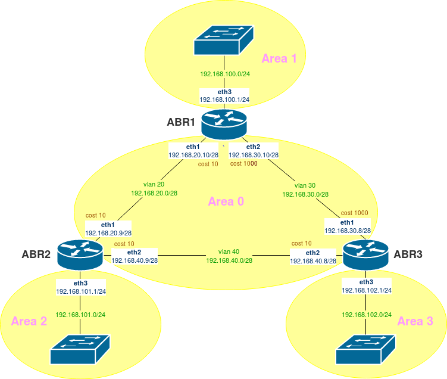

# 20. OSPF
## Задание

- Поднять три виртуалки.
- Объединить их разными vlan.

1. Поднять OSPF между машинами на базе Quagga.
2. Изобразить ассиметричный роутинг.
3. Сделать один из линков "дорогим", но что бы при этом роутинг был симметричным.

Формат сдачи:
Vagrantfile + ansible 

## Решение

## 1.Поднять OSPF между машинами на базе Quagga

#### Схема тестового стенда


#### Проверка сетевых интерфейсов (eth0 - интерфейс Vagrant)
- abr1
```
[root@abr1 vagrant]# ip -h -4 -c a
1: lo: <LOOPBACK,UP,LOWER_UP> mtu 65536 qdisc noqueue state UNKNOWN group default qlen 1000
    inet 127.0.0.1/8 scope host lo
       valid_lft forever preferred_lft forever
2: eth0: <BROADCAST,MULTICAST,UP,LOWER_UP> mtu 1500 qdisc pfifo_fast state UP group default qlen 1000
    inet 10.0.2.15/24 brd 10.0.2.255 scope global noprefixroute dynamic eth0
       valid_lft 83851sec preferred_lft 83851sec
3: eth1: <BROADCAST,MULTICAST,UP,LOWER_UP> mtu 1500 qdisc pfifo_fast state UP group default qlen 1000
    inet 192.168.20.10/28 brd 192.168.20.15 scope global noprefixroute eth1
       valid_lft forever preferred_lft forever
4: eth2: <BROADCAST,MULTICAST,UP,LOWER_UP> mtu 1500 qdisc pfifo_fast state UP group default qlen 1000
    inet 192.168.30.10/28 brd 192.168.30.15 scope global noprefixroute eth2
       valid_lft forever preferred_lft forever
5: eth3: <BROADCAST,MULTICAST,UP,LOWER_UP> mtu 1500 qdisc pfifo_fast state UP group default qlen 1000
    inet 192.168.100.1/24 brd 192.168.100.255 scope global noprefixroute eth3
       valid_lft forever preferred_lft forever
```
- abr2
```
[root@abr2 vagrant]# ip -h -4 -c a
1: lo: <LOOPBACK,UP,LOWER_UP> mtu 65536 qdisc noqueue state UNKNOWN group default qlen 1000
    inet 127.0.0.1/8 scope host lo
       valid_lft forever preferred_lft forever
2: eth0: <BROADCAST,MULTICAST,UP,LOWER_UP> mtu 1500 qdisc pfifo_fast state UP group default qlen 1000
    inet 10.0.2.15/24 brd 10.0.2.255 scope global noprefixroute dynamic eth0
       valid_lft 83857sec preferred_lft 83857sec
3: eth1: <BROADCAST,MULTICAST,UP,LOWER_UP> mtu 1500 qdisc pfifo_fast state UP group default qlen 1000
    inet 192.168.20.9/28 brd 192.168.20.15 scope global noprefixroute eth1
       valid_lft forever preferred_lft forever
4: eth2: <BROADCAST,MULTICAST,UP,LOWER_UP> mtu 1500 qdisc pfifo_fast state UP group default qlen 1000
    inet 192.168.40.9/28 brd 192.168.40.15 scope global noprefixroute eth2
       valid_lft forever preferred_lft forever
5: eth3: <BROADCAST,MULTICAST,UP,LOWER_UP> mtu 1500 qdisc pfifo_fast state UP group default qlen 1000
    inet 192.168.101.1/24 brd 192.168.101.255 scope global noprefixroute eth3
       valid_lft forever preferred_lft forever
```
- abr3
```
[root@abr3 vagrant]# ip -h -4 -c a
1: lo: <LOOPBACK,UP,LOWER_UP> mtu 65536 qdisc noqueue state UNKNOWN group default qlen 1000
    inet 127.0.0.1/8 scope host lo
       valid_lft forever preferred_lft forever
2: eth0: <BROADCAST,MULTICAST,UP,LOWER_UP> mtu 1500 qdisc pfifo_fast state UP group default qlen 1000
    inet 10.0.2.15/24 brd 10.0.2.255 scope global noprefixroute dynamic eth0
       valid_lft 83780sec preferred_lft 83780sec
3: eth1: <BROADCAST,MULTICAST,UP,LOWER_UP> mtu 1500 qdisc pfifo_fast state UP group default qlen 1000
    inet 192.168.30.8/28 brd 192.168.30.15 scope global noprefixroute eth1
       valid_lft forever preferred_lft forever
4: eth2: <BROADCAST,MULTICAST,UP,LOWER_UP> mtu 1500 qdisc pfifo_fast state UP group default qlen 1000
    inet 192.168.40.8/28 brd 192.168.40.15 scope global noprefixroute eth2
       valid_lft forever preferred_lft forever
5: eth3: <BROADCAST,MULTICAST,UP,LOWER_UP> mtu 1500 qdisc pfifo_fast state UP group default qlen 1000
    inet 192.168.102.1/24 brd 192.168.102.255 scope global noprefixroute eth3
       valid_lft forever preferred_lft forever
```
#### Проверка настроек роутеров

Команда для перехода в консоль настройки QUAGGA
```
vtysh
```
Посмотреть БД OSPF
``` 
show ip ospf database
```
Посмотреть соседние роутеры
```
show ip ospf neighbor
```
Посмотреть border-routers
```
show ip ospf border-routers
```
Посмотреть маршруты
```
show ip route
```
Посмотреть маршруты, полученные по OSPF
```
show ip ospf route
```
#### Проверка OSPF на серверах
- abr1

```
abr1# show ip ospf neighbor

    Neighbor ID Pri State           Dead Time Address         Interface            RXmtL RqstL DBsmL
192.168.101.1     1 Full/Backup       31.274s 192.168.20.9    eth1:192.168.20.10       0     0     0
192.168.102.1     1 Full/Backup       33.045s 192.168.30.8    eth2:192.168.30.10       0     0     0
```
```
abr1# show ip ospf route
============ OSPF network routing table ============
N    192.168.20.0/28       [10] area: 0.0.0.0
                           directly attached to eth1
N    192.168.30.0/28       [10] area: 0.0.0.0
                           directly attached to eth2
N    192.168.40.0/28       [20] area: 0.0.0.0
                           via 192.168.20.9, eth1
                           via 192.168.30.8, eth2
N    192.168.100.0/24      [10] area: 0.0.0.1
                           directly attached to eth3
N IA 192.168.101.0/24      [20] area: 0.0.0.0
                           via 192.168.20.9, eth1
N IA 192.168.102.0/24      [20] area: 0.0.0.0
                           via 192.168.30.8, eth2

============ OSPF router routing table =============
R    192.168.101.1         [10] area: 0.0.0.0, ABR, ASBR
                           via 192.168.20.9, eth1
R    192.168.102.1         [10] area: 0.0.0.0, ABR, ASBR
                           via 192.168.30.8, eth2

============ OSPF external routing table ===========
N E2 10.0.2.0/24           [10/20] tag: 0
                           via 192.168.20.9, eth1
                           via 192.168.30.8, eth2

```
- abr2
```
abr2# show ip ospf neighbor

    Neighbor ID Pri State           Dead Time Address         Interface            RXmtL RqstL DBsmL
192.168.100.1     1 Full/DR           34.605s 192.168.20.10   eth1:192.168.20.9        0     0     0
192.168.102.1     1 Full/Backup       38.602s 192.168.40.8    eth2:192.168.40.9        0     0     0
```
```
abr2# show ip ospf route
============ OSPF network routing table ============
N    192.168.20.0/28       [10] area: 0.0.0.0
                           directly attached to eth1
N    192.168.30.0/28       [20] area: 0.0.0.0
                           via 192.168.20.10, eth1
                           via 192.168.40.8, eth2
N    192.168.40.0/28       [10] area: 0.0.0.0
                           directly attached to eth2
N IA 192.168.100.0/24      [20] area: 0.0.0.0
                           via 192.168.20.10, eth1
N    192.168.101.0/24      [10] area: 0.0.0.2
                           directly attached to eth3
N IA 192.168.102.0/24      [20] area: 0.0.0.0
                           via 192.168.40.8, eth2

============ OSPF router routing table =============
R    192.168.100.1         [10] area: 0.0.0.0, ABR, ASBR
                           via 192.168.20.10, eth1
R    192.168.102.1         [10] area: 0.0.0.0, ABR, ASBR
                           via 192.168.40.8, eth2

============ OSPF external routing table ===========
N E2 10.0.2.0/24           [10/20] tag: 0
                           via 192.168.20.10, eth1
                           via 192.168.40.8, eth2
```
- abr3
```
abr3# show ip ospf neighbor

    Neighbor ID Pri State           Dead Time Address         Interface            RXmtL RqstL DBsmL
192.168.100.1     1 Full/DR           31.237s 192.168.30.10   eth1:192.168.30.8        0     0     0
192.168.101.1     1 Full/DR           33.520s 192.168.40.9    eth2:192.168.40.8        0     0     0
```
```
abr3# show ip ospf route
============ OSPF network routing table ============
N    192.168.20.0/28       [20] area: 0.0.0.0
                           via 192.168.30.10, eth1
                           via 192.168.40.9, eth2
N    192.168.30.0/28       [10] area: 0.0.0.0
                           directly attached to eth1
N    192.168.40.0/28       [10] area: 0.0.0.0
                           directly attached to eth2
N IA 192.168.100.0/24      [20] area: 0.0.0.0
                           via 192.168.30.10, eth1
N IA 192.168.101.0/24      [20] area: 0.0.0.0
                           via 192.168.40.9, eth2
N    192.168.102.0/24      [10] area: 0.0.0.3
                           directly attached to eth3

============ OSPF router routing table =============
R    192.168.100.1         [10] area: 0.0.0.0, ABR, ASBR
                           via 192.168.30.10, eth1
R    192.168.101.1         [10] area: 0.0.0.0, ABR, ASBR
                           via 192.168.40.9, eth2

============ OSPF external routing table ===========
N E2 10.0.2.0/24           [10/20] tag: 0
                           via 192.168.30.10, eth1
                           via 192.168.40.9, eth2
```
#### Проверка маршрутизации пакетов
- abr1
```
[root@abr1 vagrant]# tracepath 192.168.100.1;tracepath 192.168.101.1;tracepath 192.168.102.1
 1:  abr1                                                  0.038ms reached
     Resume: pmtu 65535 hops 1 back 1
 1?: [LOCALHOST]                                         pmtu 1500
 1:  192.168.101.1                                         0.346ms reached
 1:  192.168.101.1                                         0.284ms reached
     Resume: pmtu 1500 hops 1 back 1
 1?: [LOCALHOST]                                         pmtu 1500
 1:  192.168.102.1                                         0.280ms reached
 1:  192.168.102.1                                         0.296ms reached
     Resume: pmtu 1500 hops 1 back 1
```
- abr2
```
[root@abr2 vagrant]# tracepath 192.168.100.1;tracepath 192.168.101.1;tracepath 192.168.102.1
 1?: [LOCALHOST]                                         pmtu 1500
 1:  192.168.100.1                                         0.310ms reached
 1:  192.168.100.1                                         0.394ms reached
     Resume: pmtu 1500 hops 1 back 1
 1:  abr2                                                  0.034ms reached
     Resume: pmtu 65535 hops 1 back 1
 1?: [LOCALHOST]                                         pmtu 1500
 1:  192.168.102.1                                         1.671ms reached
 1:  192.168.102.1                                         0.374ms reached
     Resume: pmtu 1500 hops 1 back 1
```
- abr3
```
[root@abr3 vagrant]# tracepath 192.168.100.1;tracepath 192.168.101.1;tracepath 192.168.102.1
 1?: [LOCALHOST]                                         pmtu 1500
 1:  192.168.100.1                                         0.271ms reached
 1:  192.168.100.1                                         0.478ms reached
     Resume: pmtu 1500 hops 1 back 1
 1?: [LOCALHOST]                                         pmtu 1500
 1:  192.168.101.1                                         0.299ms reached
 1:  192.168.101.1                                         0.335ms reached
     Resume: pmtu 1500 hops 1 back 1
 1:  abr3                                                  0.030ms reached
     Resume: pmtu 65535 hops 1 back 1
```

## 2. Изобразить ассиметричный роутинг

На сервере abr1 повысим "стоимость линка" eth2 до 1000
```
[root@abr1 vagrant]# vtysh

Hello, this is Quagga (version 0.99.22.4).
Copyright 1996-2005 Kunihiro Ishiguro, et al.

abr1# configure terminal
abr1(config)# interface eth2
abr1(config-if)# ospf cost 1000
```
Проверяем маршрут от abr1 к abr3:
```
root@abr1 vagrant]# tracepath 192.168.102.1
 1?: [LOCALHOST]                                         pmtu 1500
 1:  192.168.20.9                                          0.332ms
 1:  192.168.20.9                                          0.344ms
 2:  192.168.102.1                                         0.454ms reached
     Resume: pmtu 1500 hops 2 back 2
```
Как видно, пакеты от abr1 идут уже не через eth2, а через eth1 и проходят по новому маршруту (через сервер abr2 в 2 хопа).

Проверяем, маршрут от abr3 к abr1:
```
[root@abr3 vagrant]# tracepath 192.168.100.1
 1?: [LOCALHOST]                                         pmtu1500
 1:  192.168.100.1                                         0.333ms reached
 1:  192.168.100.1                                         0.837ms reached
     Resume: pmtu 1500 hops 1 back 1
``` 
Здесь пакеты с abr3 уходят по старому короткому маршруту через интерфейс eth1.

Таким образом, роутинг ассиметричный - пакеты от abr1 к abr3 и abr3 к abr1 идут через разные машруты.

## 3. Сделать один из линков "дорогим", но что бы при этом роутинг был симметричным.

На сервере abr3 также повысим "стоимость линка" eth1 до 1000:
```
[root@abr3 vagrant]# vtysh

Hello, this is Quagga (version 0.99.22.4).
Copyright 1996-2005 Kunihiro Ishiguro, et al.

abr3# configure terminal
abr3(config)# interface eth1
abr3(config-if)# ospf cost 1000
```
Смотрим маршрут от abr1 к abr3 (он также идет через abr2 после изменений в п.2):
```
[root@abr1 vagrant]# tracepath 192.168.102.1
 1?: [LOCALHOST]                                         pmtu 1500
 1:  192.168.20.9                                          0.347ms
 1:  192.168.20.9                                          4.080ms
 2:  192.168.102.1                                         0.986ms reached
     Resume: pmtu 1500 hops 2 back 2
```
Смотрим маршрут от abr3 к abr1:
```
root@abr3 vagrant]# tracepath 192.168.100.1
 1?: [LOCALHOST]                                         pmtu1500
 1:  192.168.40.9                                          0.348ms
 1:  192.168.40.9                                          0.362ms
 2:  192.168.100.1                                         0.744ms reached
     Resume: pmtu 1500 hops 2 back 2
```
Как видно, пакеты от abr3 идут уже не через eth1, а через eth2 и проходят по новому маршруту (через abr2 в 2 хопа).

Таким образом, роутинг симметричный - пакеты от abr1 к abr3 и abr3 к abr1 идут через одинаковые машруты.