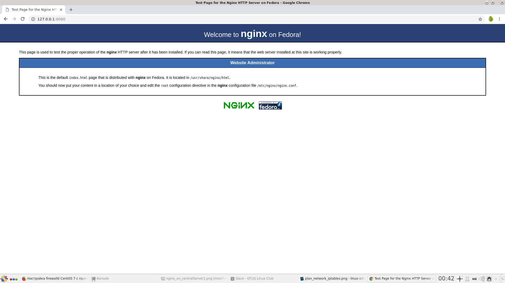

# 21. IPTABLES
## Задание

 1) Реализовать knocking port.
- centralRouter может попасть на ssh inetrRouter через knock скрипт.
2) Добавить inetRouter2, который виден(маршрутизируется) с хоста.
3) Запустить nginx на centralServer.
4) Пробросить 80й порт на inetRouter2 8080.
5) Дефолт в инет оставить через inetRouter.

Критерии оценки: 5 - все сделано. 

## Решение

Тестовый стенд разворачивается помощью Vagrant

Для запуска выполнить:

```bash
vagrant up
```
#### Схема тестового стенда


###  1.Реализовать knocking port: centralRouter может попасть на ssh inetRouter через knock скрипт

Нам необходимо запретить доступ по ssh к inetRouter всем, кроме тех, кто знает «как правильно постучаться». 

Перед ssh-подключением потребуется последовательно постучаться на следующие порты inetRouter: 8881 7777 9991 и затем в течении 30 сек открыть ssh-сессию.

Применены правила iptables на inetRouter:
```bash
# Добавляем правило для NAT, чтобы гостевые машины могли ходит в интернет через inetRouter
iptables -t nat -A POSTROUTING ! -d 192.168.0.0/16 -o eth0 -j MASQUERADE
# Правила для knocking port
# создаем 3 новые цепочки правил TRAFFIC, SSH-INPUT, SSH-INPUTTWO
iptables -t filter -N TRAFFIC
iptables -t filter -N SSH-INPUT
iptables -t filter -N SSH-INPUTTWO
# Правила для цепочки TRAFFIC
iptables -t filter -A INPUT -j TRAFFIC
iptables -t filter -A TRAFFIC -p icmp --icmp-type any -j ACCEPT
iptables -t filter -A TRAFFIC -m state --state ESTABLISHED,RELATED -j ACCEPT
iptables -t filter -A TRAFFIC -m state --state NEW -m tcp -p tcp --dport 22 -m recent --rcheck --seconds 30 --name SSH2 -j ACCEPT
iptables -t filter -A TRAFFIC -m state --state NEW -m tcp -p tcp -m recent --name SSH2 --remove -j DROP
iptables -t filter -A TRAFFIC -m state --state NEW -m tcp -p tcp --dport 9991 -m recent --rcheck --name SSH1 -j SSH-INPUTTWO
iptables -t filter -A TRAFFIC -m state --state NEW -m tcp -p tcp -m recent --name SSH1 --remove -j DROP
iptables -t filter -A TRAFFIC -m state --state NEW -m tcp -p tcp --dport 7777 -m recent --rcheck --name SSH0 -j SSH-INPUT
iptables -t filter -A TRAFFIC -m state --state NEW -m tcp -p tcp -m recent --name SSH0 --remove -j DROP
iptables -t filter -A TRAFFIC -m state --state NEW -m tcp -p tcp --dport 8881 -m recent --name SSH0 --set -j DROP
# Правила для цепочки SSH-INPUT
iptables -t filter -A SSH-INPUT -m recent --name SSH1 --set -j DROP
# Правила для цепочки SSH-INPUTTWO
iptables -t filter -A SSH-INPUTTWO -m recent --name SSH2 --set -j DROP
# 
iptables -t filter -A TRAFFIC -j DROP
iptables
# Сохраняем правила
service iptables save
```
Чтобы постучаться к inetRouter, на centralRouter используем скрипт `knock.sh` с параметрами:
- имя/ip хоста;
- порты, на которые стучимся

У нас есть 30 секунд для подключения после запуска скрипта. Если не успели за этот интервал, то придётся запускать скрипт заново.

Выполняем команду для подключения к inetRouter:
```
[root@centralRouter vagrant]# bash /vagrant/knock.sh 192.168.255.1 8881 7777 9991 && ssh vagrant@192.168.255.1
```
### 2. Добавить inetRouter2, который виден(маршрутизируется) с хоста.

в Vagrantfile настроен проброс порта 8080 inetRouter2 на 127.0.0.1 хостовой машины
```
box.vm.network 'forwarded_port', guest: 8080, host: 8080, host_ip: '127.0.0.1'
```

### 3. Запустить nginx на centralServer
Проверка: в Vagrantfile добавлен public-интерфейс - 192.168.50.12 на centralServer, который виден с моей хостовой машины (хостовая машина и centralServer в одной сети).

Стартовая страница nginx на centralServer открывается:


### 4. Пробросить http c inetRouter2:8080 на centralServer:80.

Настроен firewalld:
```bash
systemctl start firewalld
systemctl enable firewalld
# Добавить внешний сетевой интерфейс eth0 (inet) в зону public
firewall-cmd --zone=public --change-interface=eth0
# Добавить внутренний сетевой интерфейс eth1 (192.168.252.1) в зону internal
firewall-cmd --zone=internal --change-interface=eth1
# Добавить маскарадинг для зоны internal
firewall-cmd --zone=internal --add-masquerade --permanent
# Входящие запросы по tcp 8080 для зоны public перенапрвлять на 192.168.0.2:80
firewall-cmd --zone=public --add-forward-port=port=8080:proto=tcp:toport=80:toaddr=192.168.0.2 --permanent
# Применить правила фаервола
firewall-cmd --reload
```
Проверка: при обращении к 127.0.0.1:8080 на хостовой машине должна открываться страница nginx на centralServer.


### 5. Дефолт в инет оставить через inetRouter

Проверяем, что пакеты c centralServer в интернет идут через inetRouter:
```bash
[root@centralServer vagrant]# traceroute mail.ru
traceroute to mail.ru (217.69.139.200), 30 hops max, 60 byte packets
 1  gateway (192.168.0.1)  0.203 ms  0.142 ms  0.101 ms
 2  192.168.255.1 (192.168.255.1)  0.376 ms  0.342 ms  0.348 ms
 3  * * *
 4  * * *
 5  * * *
 6  * * *
 7  77.94.178.17 (77.94.178.17)  3.379 ms  3.429 ms  3.301 ms
 8  ae3-atlant-mmts9-msk.naukanet.ru (77.94.160.48)  3.257 ms  3.205 ms  2.948 ms
 9  mail-ru.naukanet.ru (77.94.167.182)  2.892 ms  2.684 ms  2.627 ms
10  * * *
11  * * *
12  *^C
[root@centralServer vagrant]#
```