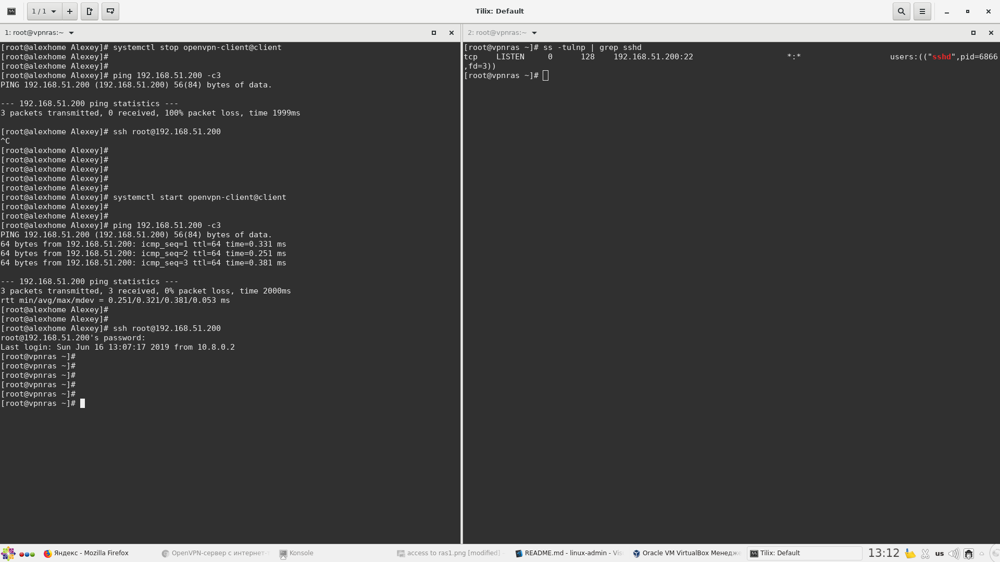

# 22. OPENVPN
## Задание

1. Между двумя виртуалками поднять vpn в режимах
- tun
- tap
Прочуствовать разницу.

2. Поднять RAS на базе OpenVPN с клиентскими сертификатами, подключиться с локальной машины на виртуалку


## Тестовые стенды 

Подготовлено 3 тестовых стенда Vagrant:
1. OpenVPN в режиме tun 
2. OpenVPN в режиме tap
3. RAS на базе OpenVPN

Для запуска нужного стенда выполнить:

```bash
vagrant up
```
## 1. Между двумя виртуалками поднять vpn в режимах tun, tap. Прочуствовать разницу.


#### Схема vpn-соединения


#### Управление службами

на сервере:
```
systemctl {stop,start,restart} openvpn-server@server
```
на клиенте:
```
systemctl {stop,start,restart} openvpn-client@client
```

#### Проверка vpn-соединения в режиме tun

- vpnserver

Интерфейсы:

```bash
[root@vpnserver vagrant]# ip -c -h -4 a
1: lo: <LOOPBACK,UP,LOWER_UP> mtu 65536 qdisc noqueue state UNKNOWN group default qlen 1000
    inet 127.0.0.1/8 scope host lo
       valid_lft forever preferred_lft forever
2: eth0: <BROADCAST,MULTICAST,UP,LOWER_UP> mtu 1500 qdisc pfifo_fast state UP group default qlen 1000
    inet 10.0.2.15/24 brd 10.0.2.255 scope global noprefixroute dynamic eth0
       valid_lft 80234sec preferred_lft 80234sec
3: eth1: <BROADCAST,MULTICAST,UP,LOWER_UP> mtu 1500 qdisc pfifo_fast state UP group default qlen 1000
    inet 192.168.100.1/24 brd 192.168.100.255 scope global noprefixroute eth1
       valid_lft forever preferred_lft forever
4: eth2: <BROADCAST,MULTICAST,UP,LOWER_UP> mtu 1500 qdisc pfifo_fast state UP group default qlen 1000
    inet 192.168.252.1/28 brd 192.168.252.15 scope global noprefixroute eth2
       valid_lft forever preferred_lft forever
5: tun0: <POINTOPOINT,MULTICAST,NOARP,UP,LOWER_UP> mtu 1500 qdisc pfifo_fast state UNKNOWN group default qlen 100
    inet 10.8.0.1 peer 10.8.0.2/32 scope global tun0
       valid_lft forever preferred_lft forever
```
Доступность внешнего интерфейса client01:
```bash
[root@vpnserver vagrant]# ping 192.168.252.2 -c 3
PING 192.168.252.2 (192.168.252.2) 56(84) bytes of data.
64 bytes from 192.168.252.2: icmp_seq=1 ttl=64 time=0.245 ms
64 bytes from 192.168.252.2: icmp_seq=2 ttl=64 time=0.252 ms
64 bytes from 192.168.252.2: icmp_seq=3 ttl=64 time=0.283 ms

--- 192.168.252.2 ping statistics ---
3 packets transmitted, 3 received, 0% packet loss, time 2005ms
rtt min/avg/max/mdev = 0.245/0.260/0.283/0.016 ms
```
Доступность внутреннего интерфейса client01:
```bash
[root@vpnserver vagrant]# ping 192.168.101.1 -c 3
PING 192.168.101.1 (192.168.101.1) 56(84) bytes of data.
64 bytes from 192.168.101.1: icmp_seq=1 ttl=64 time=0.535 ms
64 bytes from 192.168.101.1: icmp_seq=2 ttl=64 time=0.476 ms
64 bytes from 192.168.101.1: icmp_seq=3 ttl=64 time=0.539 ms

--- 192.168.101.1 ping statistics ---
3 packets transmitted, 3 received, 0% packet loss, time 2005ms
rtt min/avg/max/mdev = 0.476/0.516/0.539/0.038 ms
```
Доступность tun-интерфейса client01 (должен быть поднят для создания тунеля)
```bash
[root@vpnserver vagrant]# ping 10.8.0.6 -c 3
PING 10.8.0.6 (10.8.0.6) 56(84) bytes of data.
64 bytes from 10.8.0.6: icmp_seq=1 ttl=64 time=0.602 ms
64 bytes from 10.8.0.6: icmp_seq=2 ttl=64 time=0.514 ms
64 bytes from 10.8.0.6: icmp_seq=3 ttl=64 time=0.475 ms

--- 10.8.0.6 ping statistics ---
3 packets transmitted, 3 received, 0% packet loss, time 2003ms
rtt min/avg/max/mdev = 0.475/0.530/0.602/0.056 ms
```
- client01

Интерфейсы:

```bash
[root@client01 vagrant]# ip -c -h -4 a
1: lo: <LOOPBACK,UP,LOWER_UP> mtu 65536 qdisc noqueue state UNKNOWN group default qlen 1000
    inet 127.0.0.1/8 scope host lo
       valid_lft forever preferred_lft forever
2: eth0: <BROADCAST,MULTICAST,UP,LOWER_UP> mtu 1500 qdisc pfifo_fast state UP group default qlen 1000
    inet 10.0.2.15/24 brd 10.0.2.255 scope global noprefixroute dynamic eth0
       valid_lft 78788sec preferred_lft 78788sec
3: eth1: <BROADCAST,MULTICAST,UP,LOWER_UP> mtu 1500 qdisc pfifo_fast state UP group default qlen 1000
    inet 192.168.101.1/24 brd 192.168.101.255 scope global noprefixroute eth1
       valid_lft forever preferred_lft forever
4: eth2: <BROADCAST,MULTICAST,UP,LOWER_UP> mtu 1500 qdisc pfifo_fast state UP group default qlen 1000
    inet 192.168.252.2/28 brd 192.168.252.15 scope global noprefixroute eth2
       valid_lft forever preferred_lft forever
5: tun0: <POINTOPOINT,MULTICAST,NOARP,UP,LOWER_UP> mtu 1500 qdisc pfifo_fast state UNKNOWN group default qlen 100
    inet 10.8.0.6 peer 10.8.0.5/32 scope global tun0
       valid_lft forever preferred_lft forever
```
Доступность внешнего интерфейса vpnserver:
```bash
[root@client01 vagrant]# ping 192.168.252.1 -c3
PING 192.168.252.1 (192.168.252.1) 56(84) bytes of data.
64 bytes from 192.168.252.1: icmp_seq=1 ttl=64 time=0.258 ms
64 bytes from 192.168.252.1: icmp_seq=2 ttl=64 time=0.283 ms
64 bytes from 192.168.252.1: icmp_seq=3 ttl=64 time=0.261 ms

--- 192.168.252.1 ping statistics ---
3 packets transmitted, 3 received, 0% packet loss, time 2010ms
rtt min/avg/max/mdev = 0.258/0.267/0.283/0.017 ms
```
Доступность внутреннего интерфейса vpnserver:
```bash
[root@client01 vagrant]# ping 192.168.100.1 -c3
PING 192.168.100.1 (192.168.100.1) 56(84) bytes of data.
64 bytes from 192.168.100.1: icmp_seq=1 ttl=64 time=0.558 ms
64 bytes from 192.168.100.1: icmp_seq=2 ttl=64 time=0.468 ms
64 bytes from 192.168.100.1: icmp_seq=3 ttl=64 time=0.486 ms

--- 192.168.100.1 ping statistics ---
3 packets transmitted, 3 received, 0% packet loss, time 2010ms
rtt min/avg/max/mdev = 0.468/0.504/0.558/0.038 ms
[root@client01 vagrant]#
```
Доступность tun-интерфейса vpnserver (на сервере всегда 10.8.0.1):
```bash
[root@client01 vagrant]# ping 10.8.0.1 -c3
PING 10.8.0.1 (10.8.0.1) 56(84) bytes of data.
64 bytes from 10.8.0.1: icmp_seq=1 ttl=64 time=0.496 ms
64 bytes from 10.8.0.1: icmp_seq=2 ttl=64 time=0.455 ms
64 bytes from 10.8.0.1: icmp_seq=3 ttl=64 time=0.553 ms

--- 10.8.0.1 ping statistics ---
3 packets transmitted, 3 received, 0% packet loss, time 2011ms
rtt min/avg/max/mdev = 0.455/0.501/0.553/0.044 ms
```
- Тестируем пропускную способность канала в режиме tun

на vpnserver запускаем iperf в режиме сервера (отчет в Мбайтах)
```bash
[root@vpnserver vagrant]# iperf -s -f M
------------------------------------------------------------
Server listening on TCP port 5001
TCP window size: 0.08 MByte (default)
------------------------------------------------------------
[  4] local 192.168.100.1 port 5001 connected with 10.8.0.6 port 59646
[ ID] Interval       Transfer     Bandwidth
[  4]  0.0-32.2 sec  1000 MBytes  31.0 MBytes/sec
```
c client01 передаем на vpnserver данные 1000 Мб (отчет в Мбайтах)
```bash
[root@client01 vagrant]# iperf -c 192.168.100.1 -n 1000M -f M
------------------------------------------------------------
Client connecting to 192.168.100.1, TCP port 5001
TCP window size: 0.12 MByte (default)
------------------------------------------------------------
[  3] local 10.8.0.6 port 59646 connected with 192.168.100.1 port 5001
[ ID] Interval       Transfer     Bandwidth
[  3]  0.0-32.2 sec  1000 MBytes  31.1 MBytes/sec
```

#### Проверка vpn-соединения в режиме tap

Для работы vpn в режиме tap в конфигурационных файлах server.conf и client01.conf изменен параметр:
```
dev tun
```
на
```
dev tap
```
Был добавлен маршрут в сеть 192.168.101.0 в /etc/openvpn/server.conf (иначе пинг с сервера на клиента не шел): 
```
route 192.168.101.0 255.255.255.0 10.8.0.1
```
Параметры push и client-config-dir /etc/openvpn/ccd закомментированы (были предупреждения в логах).

- Тестируем пропускную способность канала в режиме tap

на vpnserver запускаем iperf в режиме сервера (отчет в Мбайтах)
```bash
root@vpnserver server]# iperf -s -f M
------------------------------------------------------------
Server listening on TCP port 5001
TCP window size: 0.08 MByte (default)
------------------------------------------------------------
[  4] local 192.168.100.1 port 5001 connected with 10.8.0.2 port 58980
[ ID] Interval       Transfer     Bandwidth
[  4]  0.0-34.7 sec  1000 MBytes  28.8 MBytes/sec
```
c client01 передаем на vpnserver данные 1000 Мб (отчет в Мбайтах)
```bash
[root@client01 vagrant]# iperf -c 192.168.100.1 -n 1000M -f M
------------------------------------------------------------
Client connecting to 192.168.100.1, TCP port 5001
TCP window size: 0.10 MByte (default)
------------------------------------------------------------
[  3] local 10.8.0.2 port 58980 connected with 192.168.100.1 port 5001
[ ID] Interval       Transfer     Bandwidth
[  3]  0.0-34.6 sec  1000 MBytes  28.9 MBytes/sec
```
Результат проверки: пропускная способность канала в режиме tun выше, чем tap.

## 2. Поднять RAS на базе OpenVPN с клиентскими сертификатами, подключиться с локальной машины на виртуалку

OpenVPN-сервер vpnras запускается в Vagrant.

Интерфейсы:

- eth0: интернет
- eth1 (public): 192.168.50.200/24 - используется для vpn-соединения (ip из домашней подсети)
- eth2 (private): 192.168.51.200/24 - прослушивается ssh-сервером

Затем развернул OpenVPN в режиме client на локальной машине и скопировал с сервера созданные сертификаты:
```
# устаналиваем пакеты
yum install epel-release bridge-utils openvpn sshpass -y

# создаем каталог для логов и ключей openvpn 
mkdir /var/log/openvpn && mkdir /etc/openvpn/keys

# копируем готовый клиентский конфиг и ключи с vpn-сервера на свой хост:

# Если возникла ошибка WARNING: REMOTE HOST IDENTIFICATION HAS CHANGED! перегенируем ключи:
# ssh-keygen -R 192.168.50.200

sshpass -p "vagrant" scp -o "StrictHostKeyChecking=no" root@192.168.50.200:/vagrant/client.conf /etc/openvpn/client/ &&
sshpass -p "vagrant" scp -o "StrictHostKeyChecking=no" root@192.168.50.200:/usr/share/easy-rsa/3.0.3/pki/ca.crt /etc/openvpn/keys/ &&
sshpass -p "vagrant" scp -o "StrictHostKeyChecking=no" root@192.168.50.200:/usr/share/easy-rsa/3.0.3/pki/issued/client01.crt /etc/openvpn/keys/ &&
sshpass -p "vagrant" scp -o "StrictHostKeyChecking=no" root@192.168.50.200:/usr/share/easy-rsa/3.0.3/pki/private/client01.key /etc/openvpn/keys/ &&
sshpass -p "vagrant" scp -o "StrictHostKeyChecking=no" root@192.168.50.200:/usr/share/easy-rsa/3.0.3/ta.key /etc/openvpn/keys/

# запускаем клиента
systemctl restart openvpn-client@client
```
После настройки клиента, подключаемся к серверу через тунель и настриваем sshd:
```
# Может понадобиться вначале перегенировать ключи ssh на клиенте
[Alexey@alexhome ras]$ ssh-keygen -R 192.168.51.200
The authenticity of host '192.168.51.200 (192.168.51.200)' can't be established.ECDSA key fingerprint is SHA256:ZgfvOwjt/ST32pvqZJ6hNKcadwMjFMsO0+j5R5pjEkg.ECDSA key fingerprint is MD5:4a:9f:53:5e:6d:ff:b2:3e:b8:3a:c5:d3:2d:1e:9b:c1.Are you sure you want to continue connecting (yes/no)? yesWarning: Permanently added '192.168.51.200' (ECDSA) to the list of known hosts.

# Подключаемся к vpnras через тунель:
[Alexey@alexhome ras]$ ssh root@192.168.51.200

# Говорим sshd-серверу принимать подключения только на интерфейсе 192.168.51.200
# Интерфейс 192.168.50.200 слушаться не будет.
[root@vpnras ~]# sed -i '19i ListenAddress 192.168.51.200' /etc/ssh/sshd_config
[root@vpnras ~]# systemctl reload sshd
```

#### Проверка ssh-подключения к vpnras

После этого локальная машина должна подключаться по ssh к vpnras только через vpn-тунель.



