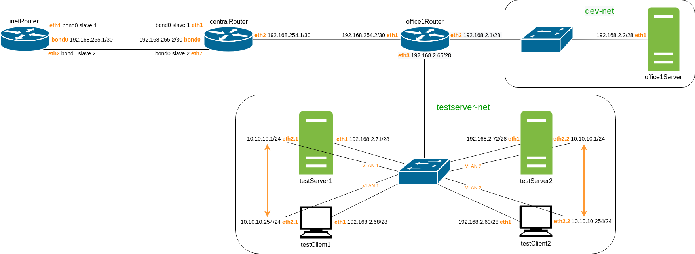
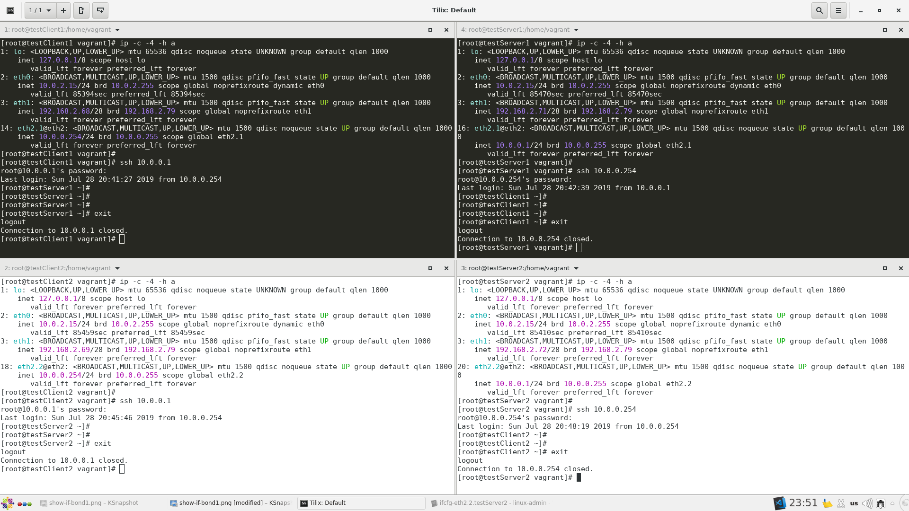
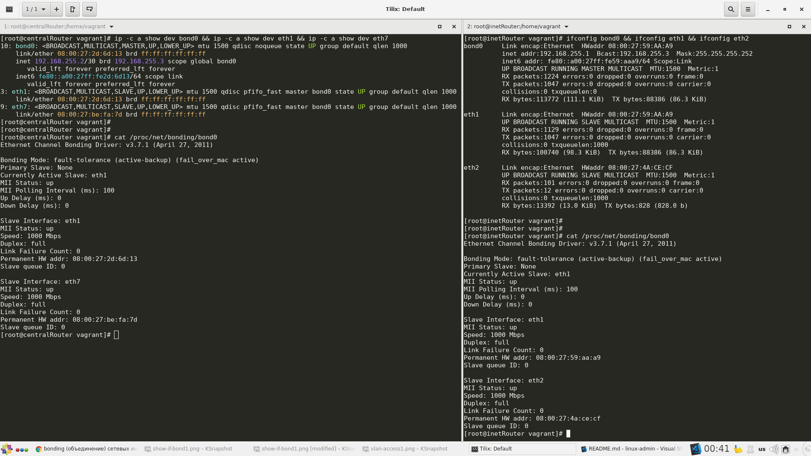
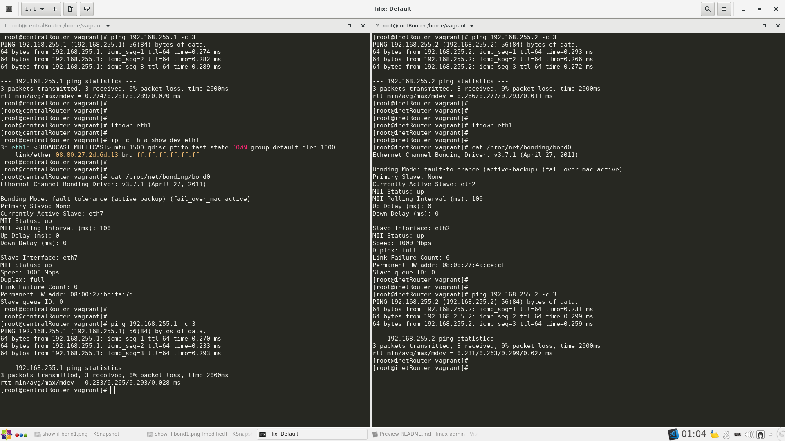
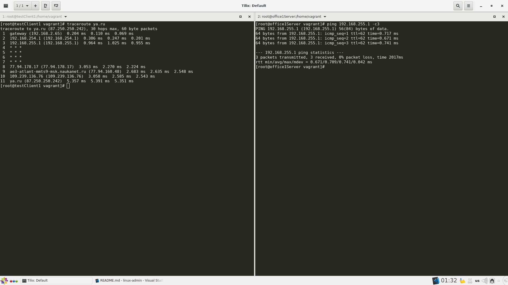

# 23. Создание VLAN и бондов
## Задание

### Cтроим бонды и вланы

В Office1 в тестовой подсети (`testserv-net`) появляются сервера с дополнительными интерфесами и адресами.  
В internal сети `testLAN`:
- `testClient1`: 10.10.10.254
- `testClient2`: 10.10.10.254
- `testServer1`: 10.10.10.1 
- `testServer2`: 10.10.10.1

Развести вланами:  
`testClient1` <-> `testServer1`  
`testClient2` <-> `testServer2`

Между `centralRouter` и `inetRouter` "пробросить" 2 линка (общая inernal сеть) и объединить их в бонд.   
Проверить работу c отключением интерфейсов.

Для сдачи - Vagrantfile с требуемой конфигурацией.  
Разворачиваться конфигурация должна через ansible.


### Тестовый стенд

За основу взят стенд из д/з 18 "Разворачиваем сетевую лабораторию".   
Конфигурация разворчивается в Vagrant через Ansible.  
Запустить стенд:
```
vagrant up
```
Cхема сети:


### Настройка вланов в Linux

В тестовой подсети testLAN имеются вланы:
- VLAN 1: `testClient1` (eth2), `testServer1` (eth2)
- VLAN 2: `testClient2` (eth2), `testServer2` (eth2)  

Проверяем, что хосты из одного влана видят друг друга:



### Настройка бондинга

Для реализации бондинга используются интерфейсы:  
- на `centralRouter`: eth1,eth7
- на `inetRouter`: eth1,eth2  

Режим бондинга: active-backup.   
Первый интерфейс работает в активном режиме, второй - в ожидающем. Если активный падает, управление передается ожидающему. Не требует поддержки данной функциональности от коммутатора.  


Проверяем настроенные бондинг-интерфейсы:  



Проверяем отказоустойчивость сети, отключив линк eth1 на каждом хосте:



Проверяем, что после перехода на бэкапные линки другие хосты могут отправлять пакеты `inetRouter`

