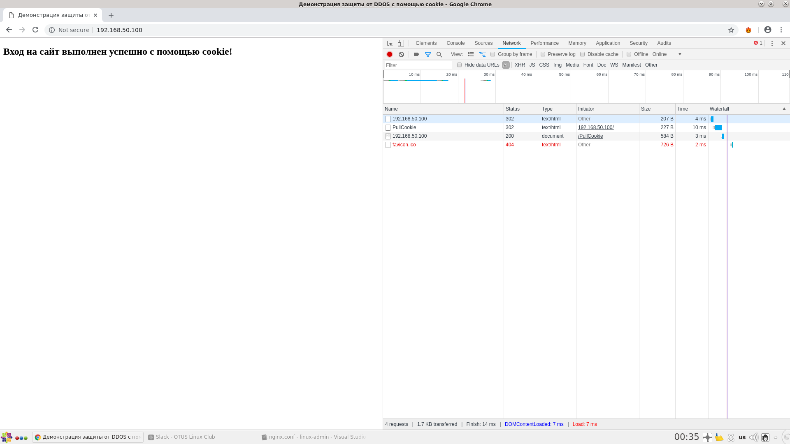

# 25. Web-серверы

## Задание

Простая защита от DDOS.

Написать конфигурацию nginx, которая даёт доступ клиенту только с определенной cookie. Если у клиента её нет, нужно выполнить редирект на location, в котором кука будет добавлена,после чего клиент будет обратно отправлен (редирект) на запрашиваемый ресурс.

Смысл: умные боты попадаются редко, тупые боты по редиректам с куками два раза не пойдут

Для выполнения ДЗ понадобятся

https://nginx.org/ru/docs/http/ngx_http_rewrite_module.html

https://nginx.org/ru/docs/http/ngx_http_headers_module.html

## Запуск тестового стенда

Тестовый стенд: `Vagrant` + `Ansible`

Запустить стенд: 
```bash
vagrant up
vagrant ssh webserver
```
NGINX отдает web-страницу по адресу `192.168.50.100` на порту `80`.

В `Vagrantfile` указал для сервера тип сетевого соединения `public network` (выделил NGINX ip-адрес из хостовой подсети):
```bash
webserver.vm.network "public_network", ip: "192.168.50.100"
```

## Проверка

Запускаем в браузере `Google Chrome` инструмент разработчика (`F12`) и открываем web-страницу `http://192.168.50.100`. 



Таким образом выполняется: 
1. Переход на запрашиваемый ресурс в location `/` 
2. Редирект в location `PullCookie` для получения нужной cookie.
3. Обратный редирект в location `/` уже c cookie.

Также можно проверить утилитой `curl`:

```bash
curl --cookie no  --location 192.168.50.100 --head

HTTP/1.1 302 Moved Temporarily
Server: nginx/1.12.2
Date: Wed, 10 Jul 2019 11:04:42 GMT
Content-Type: text/html
Content-Length: 161
Connection: keep-alive
Location: http://192.168.50.100/PullCookie

HTTP/1.1 302 Moved Temporarily
Server: nginx/1.12.2
Date: Wed, 10 Jul 2019 11:04:42 GMT
Content-Type: text/html
Content-Length: 161
Connection: keep-alive
Location: http://192.168.50.100/
Set-Cookie: access=CookieKey

HTTP/1.1 200 OK
Server: nginx/1.12.2
Date: Wed, 10 Jul 2019 11:04:42 GMT
Content-Type: text/html
Content-Length: 346
Last-Modified: Tue, 09 Jul 2019 21:29:06 GMT
Connection: keep-alive
ETag: "5d250722-15a"
Accept-Ranges: bytes
```