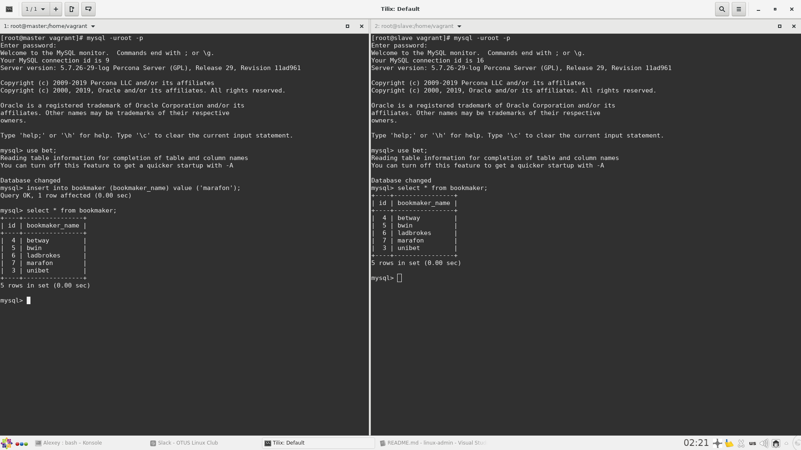
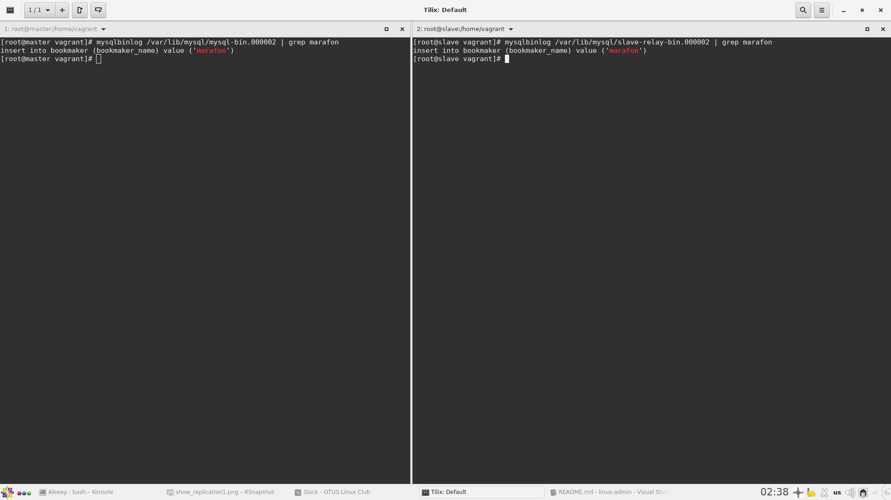

# 22. MySQL-репликация

## Задание

Развернуть базу из дампа bet.dmp на мастер-сервере MySQL и настроить репликацию на слейв следующих таблиц:

- bookmaker;
- competition;
- market;
- odds;
- outcome;

Настроить GTID репликацию.

Варианты которые принимаются к сдаче:

- рабочий вагрантафайл;
- скрины или логи SHOW TABLES;
- конфиги;
- пример в логе изменения строки и появления строки на реплике.

## Тестовый стенд

Запускается в Vagrant:

```bash
vagrant up
```
Разворачиваются хосты c Percona Server for MySQL 5.7:

- master: 192.168.10.10/24
- slave:  192.168.10.11/24

Логин: ```root```, пароль: ```2019MyPassw0rd$%^```

- bet.dmp - дамп базы
- master.sql - бэкап для заливки c master на slave
- конфиги mysql приложены

## Проверка репликации на slave

- Проверяем статус slave-сервера:
```bash
[root@slave vagrant]# mysql -uroot -p
Enter password:
Welcome to the MySQL monitor.  Commands end with ; or \g.
Your MySQL connection id is 10
Server version: 5.7.26-29-log Percona Server (GPL), Release 29, Revision 11ad961

Copyright (c) 2009-2019 Percona LLC and/or its affiliates
Copyright (c) 2000, 2019, Oracle and/or its affiliates. All rights reserved.

Oracle is a registered trademark of Oracle Corporation and/or its
affiliates. Other names may be trademarks of their respective
owners.

Type 'help;' or '\h' for help. Type '\c' to clear the current input statement.

mysql> show slave status\G
*************************** 1. row ***************************
               Slave_IO_State: Waiting for master to send event
                  Master_Host: 192.168.10.10
                  Master_User: repl
                  Master_Port: 3306
                Connect_Retry: 60
              Master_Log_File: mysql-bin.000002
          Read_Master_Log_Pos: 119546
               Relay_Log_File: slave-relay-bin.000002
                Relay_Log_Pos: 119759
        Relay_Master_Log_File: mysql-bin.000002
             Slave_IO_Running: Yes
            Slave_SQL_Running: Yes
              Replicate_Do_DB:
          Replicate_Ignore_DB:
           Replicate_Do_Table:
       Replicate_Ignore_Table: bet.events_on_demand,bet.v_same_event
      Replicate_Wild_Do_Table:
  Replicate_Wild_Ignore_Table:
                   Last_Errno: 0
                   Last_Error:
                 Skip_Counter: 0
          Exec_Master_Log_Pos: 119546
              Relay_Log_Space: 119966
              Until_Condition: None
               Until_Log_File:
                Until_Log_Pos: 0
           Master_SSL_Allowed: No
           Master_SSL_CA_File:
           Master_SSL_CA_Path:
              Master_SSL_Cert:
            Master_SSL_Cipher:
               Master_SSL_Key:
        Seconds_Behind_Master: 0
Master_SSL_Verify_Server_Cert: No
                Last_IO_Errno: 0
                Last_IO_Error:
               Last_SQL_Errno: 0
               Last_SQL_Error:
  Replicate_Ignore_Server_Ids:
             Master_Server_Id: 1
                  Master_UUID: 628693a1-9473-11e9-81e9-525400f0e95b
             Master_Info_File: /var/lib/mysql/master.info
                    SQL_Delay: 0
          SQL_Remaining_Delay: NULL
      Slave_SQL_Running_State: Slave has read all relay log; waiting for more updates
           Master_Retry_Count: 86400
                  Master_Bind:
      Last_IO_Error_Timestamp:
     Last_SQL_Error_Timestamp:
               Master_SSL_Crl:
           Master_SSL_Crlpath:
           Retrieved_Gtid_Set: 628693a1-9473-11e9-81e9-525400f0e95b:1-39
            Executed_Gtid_Set: 628693a1-9473-11e9-81e9-525400f0e95b:1-39,
aed8fe1e-9473-11e9-83a5-525400f0e95b:1
                Auto_Position: 1
         Replicate_Rewrite_DB:
                 Channel_Name:
           Master_TLS_Version:
1 row in set (0.00 sec)

mysql>
```

Здесь важные показатели:

```bash
Slave_IO_Running: Yes
Slave_SQL_Running: Yes
```
- Проверяем таблицы БД "bet"

на master:
```bash
mysql> show databases;
+--------------------+
| Database           |
+--------------------+
| information_schema |
| bet                |
| mysql              |
| performance_schema |
| sys                |
+--------------------+
5 rows in set (0.00 sec)

mysql> use bet;
Reading table information for completion of table and column names
You can turn off this feature to get a quicker startup with -A

Database changed
mysql> show tables;
+------------------+
| Tables_in_bet    |
+------------------+
| bookmaker        |
| competition      |
| events_on_demand |
| market           |
| odds             |
| outcome          |
| v_same_event     |
+------------------+
7 rows in set (0.00 sec)
```
на slave:

```bash
mysql> show databases;
+--------------------+
| Database           |
+--------------------+
| information_schema |
| bet                |
| mysql              |
| performance_schema |
| sys                |
+--------------------+
5 rows in set (0.00 sec)

mysql> use bet;
Reading table information for completion of table and column names
You can turn off this feature to get a quicker startup with -A

Database changed
mysql> show tables;
+---------------+
| Tables_in_bet |
+---------------+
| bookmaker     |
| competition   |
| market        |
| odds          |
| outcome       |
+---------------+
5 rows in set (0.00 sec)

mysql> select * from bookmaker;
+----+----------------+
| id | bookmaker_name |
+----+----------------+
|  4 | betway         |
|  5 | bwin           |
|  6 | ladbrokes      |
|  3 | unibet         |
+----+----------------+
4 rows in set (0.00 sec)
```
Таким образом, репликация на slave таблиц ```events_on_demand```, ```v_same_event``` не выполняется, т.к. они добавлены в исключение.

- Проверяем репликацию на slave после добавления на master новой записи "marafon" в таблицу "bookmaker_name": 



- Проверяем, что транзакция записалась в журнал транзакций binlog на master и slave:

 