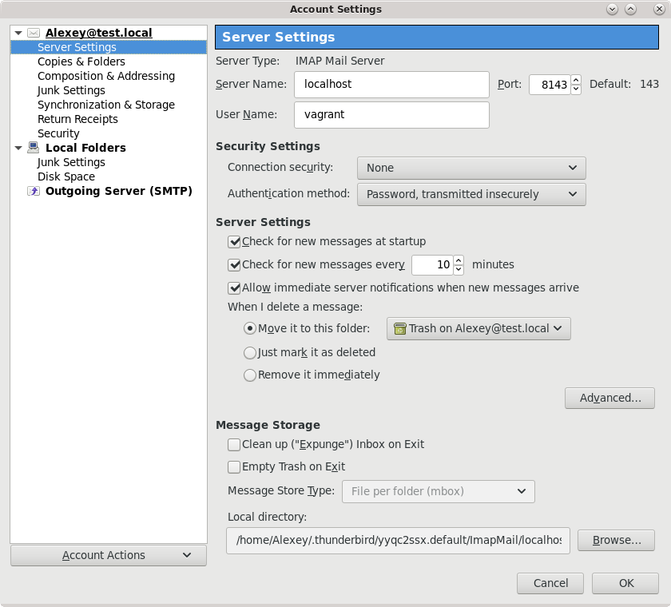
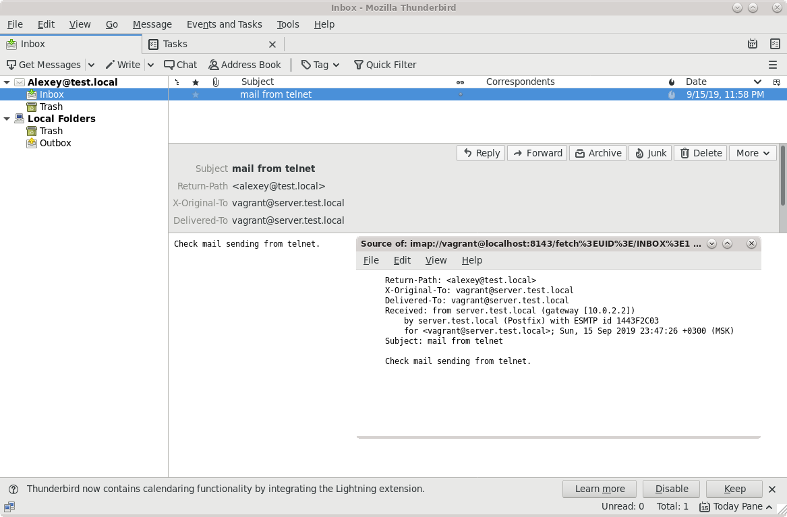

# 28. Postfix  

## Задание

Установка почтового сервера
1. Установить в виртуалке `postfix+dovecot` для приёма почты на виртуальный домен любым обсужденным на семинаре способом.
2. Отправить почту телнетом с хоста на виртуалку.
3. Принять почту на хост почтовым клиентом

Результат
1. Полученное письмо со всеми заголовками.
2. Конфиги `postfix` и `dovecot`.

## Тестовый стенд

`Vagrant + Ansible`

Запуск стенда:

```
vagrant up
```

## Проверка

Отправка c хоста письма через `telnet`: 
```
[Alexey@alexhome 29-postfix]$ telnet server.test.local 8025
Trying 192.168.101.1...
Connected to server.test.local.
Escape character is '^]'.
220 server.test.local ESMTP Postfix
ehlo server.test.local
250-server.test.local
250-PIPELINING
250-SIZE 10240000
250-VRFY
250-ETRN
250-ENHANCEDSTATUSCODES
250-8BITMIME
250 DSN
mail from: alexey@test.local
250 2.1.0 Ok
rcpt to: vagrant@server.test.local
250 2.1.5 Ok
data
354 End data with <CR><LF>.<CR><LF>
Subject: mail from telnet
Check mail sending from telnet.
.
250 2.0.0 Ok: queued as 1443F2C03
```

Проверка получения письма через `telnet` на хосте:
```
[Alexey@alexhome 29-postfix]$ telnet localhost 8143
Trying ::1...
telnet: connect to address ::1: Connection refused
Trying 127.0.0.1...
Connected to localhost.
Escape character is '^]'.
* OK [CAPABILITY IMAP4rev1 LITERAL+ SASL-IR LOGIN-REFERRALS ID ENABLE IDLE AUTH=PLAIN] Dovecot ready.
a login "vagrant" "password"
a OK [CAPABILITY IMAP4rev1 LITERAL+ SASL-IR LOGIN-REFERRALS ID ENABLE IDLE SORT SORT=DISPLAY THREAD=REFERENCES THREAD=REFS THREAD=ORDEREDSUBJECT MULTIAPPEND URL-PARTIAL CATENATE UNSELECT CHILDREN NAMESPACE UIDPLUS LIST-EXTENDED I18NLEVEL=1 CONDSTORE QRESYNC ESEARCH ESORT SEARCHRES WITHIN CONTEXT=SEARCH LIST-STATUS BINARY MOVESNIPPET=FUZZY SPECIAL-USE] Logged in
b select inbox
* FLAGS (\Answered \Flagged \Deleted \Seen \Draft)
* OK [PERMANENTFLAGS (\Answered \Flagged \Deleted \Seen \Draft \*)] Flags permitted.
* 1 EXISTS
* 1 RECENT
* OK [UNSEEN 1] First unseen.
* OK [UIDVALIDITY 1568580543] UIDs valid
* OK [UIDNEXT 2] Predicted next UID
b OK [READ-WRITE] Select completed (0.002 + 0.000 + 0.002 secs).
```

Получение письма почтовым клиентом:



